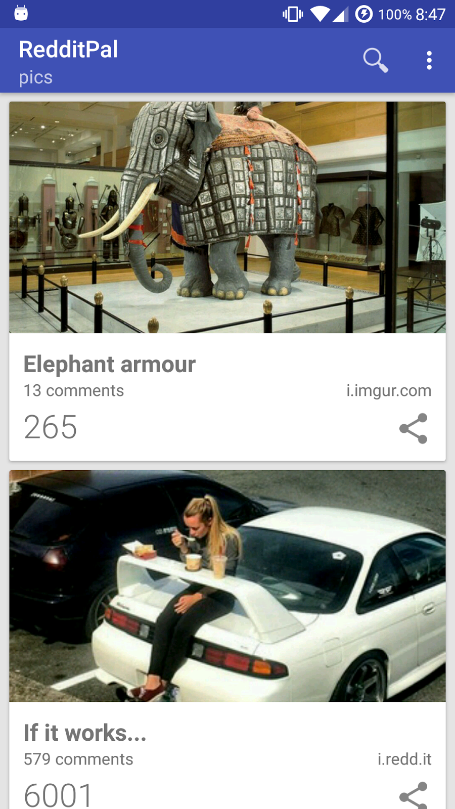
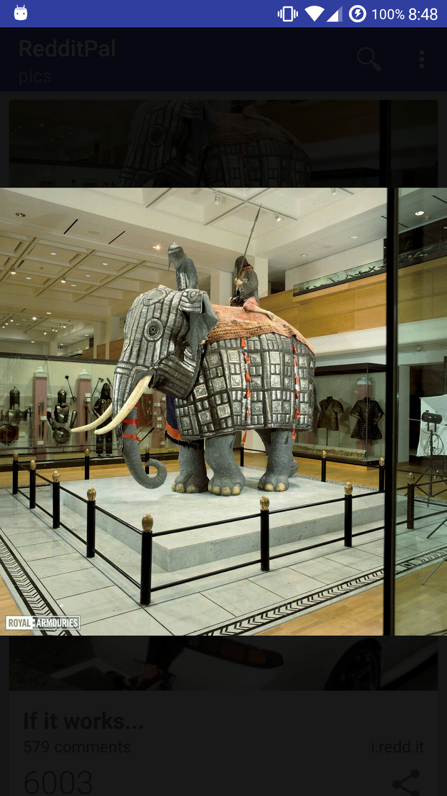
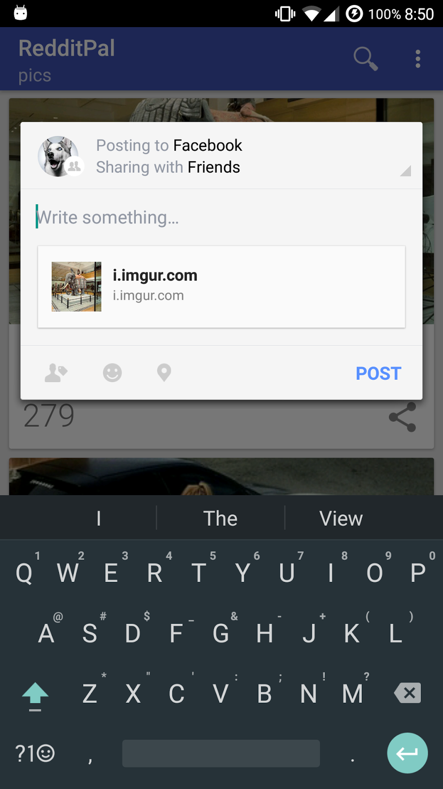
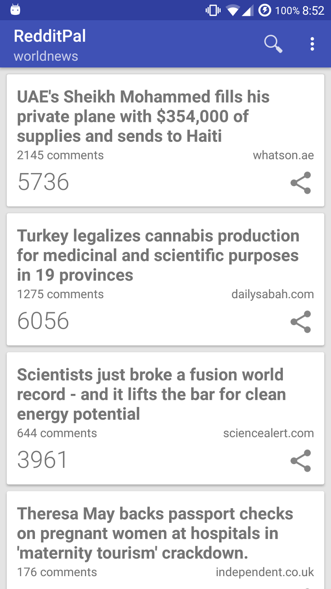
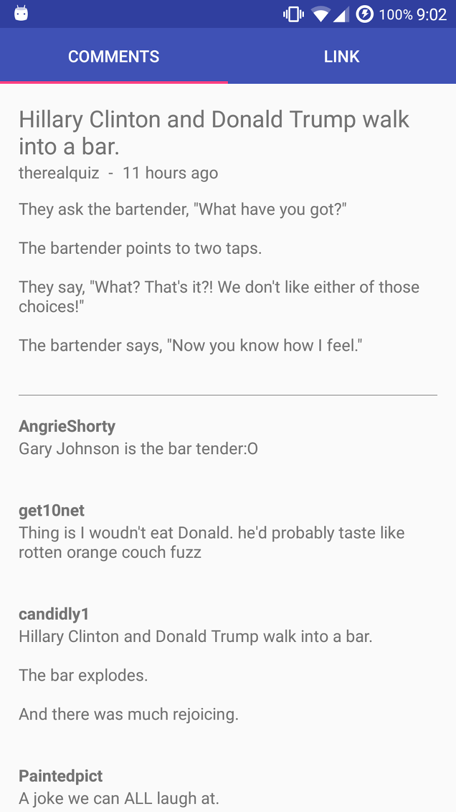
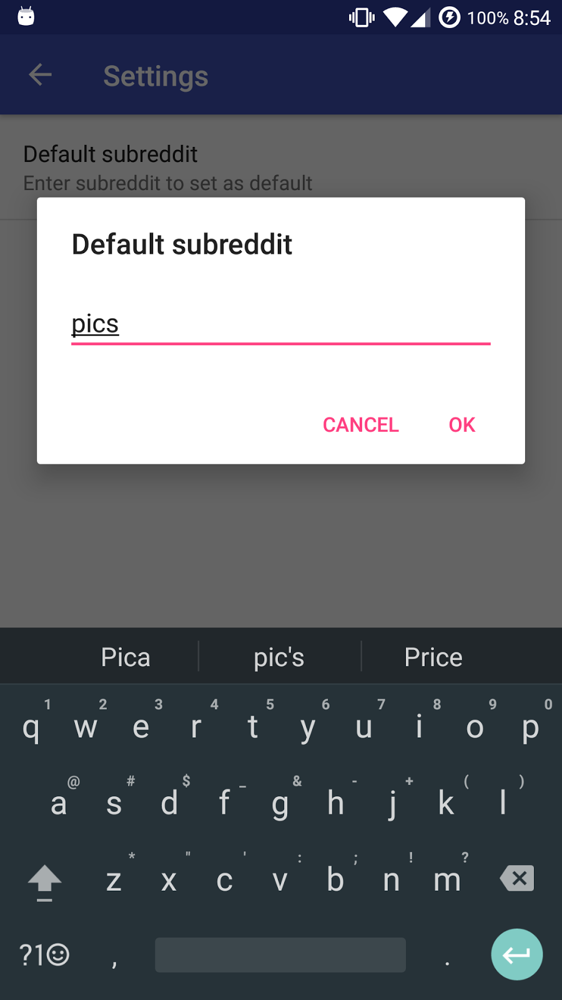

# RedditPal

### Features

* View posts, comments and images
* Open links in WebView within app
* Click posts to view supporting content
* Display posts from user-defined subreddit
* Set default subreddit to be shown on launch
* Share content to social medias and other apps
* Display images in fullscreen + pinch to zoom

### Screenshots

### Libraries used

 * [Retrofit 2](https://square.github.io/retrofit/) for making calls to the reddit api
 * [Gson](https://github.com/google/gson) for deserialization of JSON data
 * [Glide](https://github.com/bumptech/glide) for image loading and caching
 * [PhotoView](https://github.com/chrisbanes/PhotoView) for zoomable images
 * [PrettyTime](http://www.ocpsoft.org/prettytime/) for relative timestamp formatting
